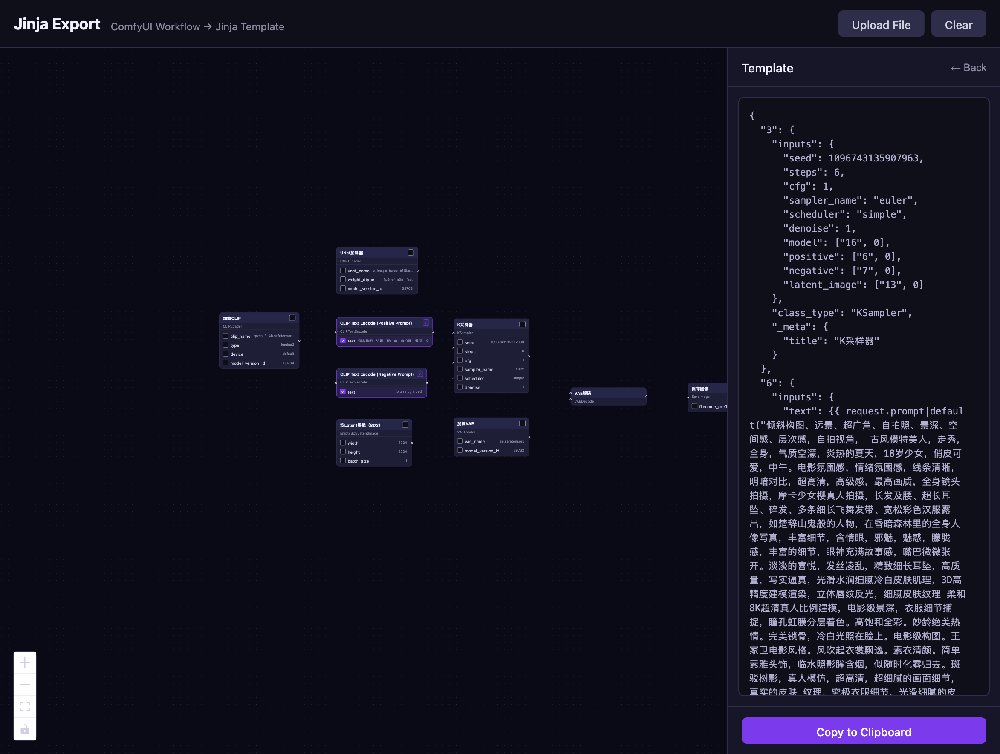

# ComfyUI Jinja Export

将 ComfyUI 工作流 JSON 转换为 Jinja 模板的纯前端工具。



## 功能

- **可视化节点编辑器**：以节点图的形式渲染 ComfyUI 工作流，支持拖拽、缩放
- **字段选择**：在节点上勾选需要参数化的字段，自动生成 Jinja 变量
- **变量重命名**：自定义 Jinja 变量名（如将 `text` 改为 `positive_prompt`）
- **值修改**：直接在节点上编辑字段值
- **自动格式检测**：支持 ComfyUI API 格式和 Workflow 格式，自动识别并转换
- **Jinja 模板导出**：生成 `{{ request.xxx|default(原始值) }}` 格式的模板

## 使用方式

1. 启动开发服务器：

```bash
npm install
npm run dev
```

2. 打开浏览器访问 `http://localhost:5173`

3. 拖拽或上传 ComfyUI 工作流 JSON 文件

4. 在画布上点击节点字段的复选框，选择需要参数化的字段

5. 在右侧面板修改变量名，点击 "Export Template" 导出 Jinja 模板

## 支持的 JSON 格式

### API 格式

ComfyUI `app.graphToPrompt().output` 返回的格式，结构为：

```json
{
  "3": {
    "inputs": {
      "seed": 42,
      "steps": 20,
      "model": ["4", 0]
    },
    "class_type": "KSampler",
    "_meta": { "title": "KSampler" }
  }
}
```

### Workflow 格式

ComfyUI 保存的 `.json` 文件格式，结构为：

```json
{
  "nodes": [
    { "id": 3, "type": "KSampler", "widgets_values": [...], "inputs": [...] }
  ],
  "links": [
    [linkId, sourceNodeId, sourceSlot, targetNodeId, targetSlot, type]
  ]
}
```

上传时会自动检测格式，如果是 Workflow 格式会自动转换为 API 格式。

## Jinja 模板输出示例

选择 `seed` 和 `text` 字段后，生成的模板：

```json
{
  "3": {
    "inputs": {
      "seed": {{ request.seed|default(42) }},
      "steps": 20
    },
    "class_type": "KSampler"
  },
  "6": {
    "inputs": {
      "text": {{ request.text|default("hello world") }}
    },
    "class_type": "CLIPTextEncode"
  }
}
```

- 数字类型：`{{ request.xxx|default(42) }}` — 不加引号
- 字符串类型：`{{ request.xxx|default("hello") }}` — 自动加引号

## 开发

```bash
npm run dev       # 启动开发服务器
npm run build     # 生产构建
npm test          # 运行测试
```

## 项目结构

```
src/
├── lib/
│   ├── types.ts      # TypeScript 类型定义
│   ├── jinja.ts      # Jinja 模板生成逻辑
│   ├── graph.ts      # 图解析与 dagre 自动布局
│   └── convert.ts    # Workflow → API 格式转换
├── WorkflowNode.tsx  # ReactFlow 自定义节点组件
├── App.tsx           # 主应用组件
├── App.css           # 布局样式
└── index.css         # 全局样式
```
